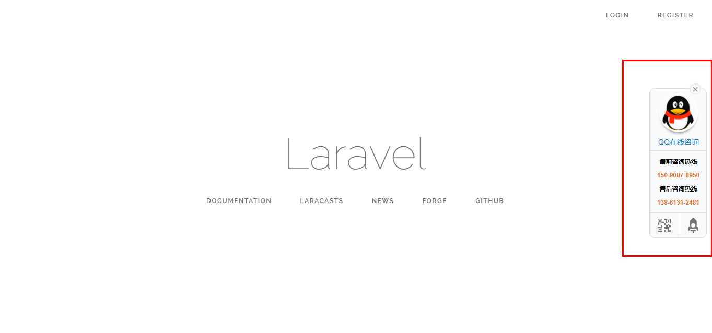
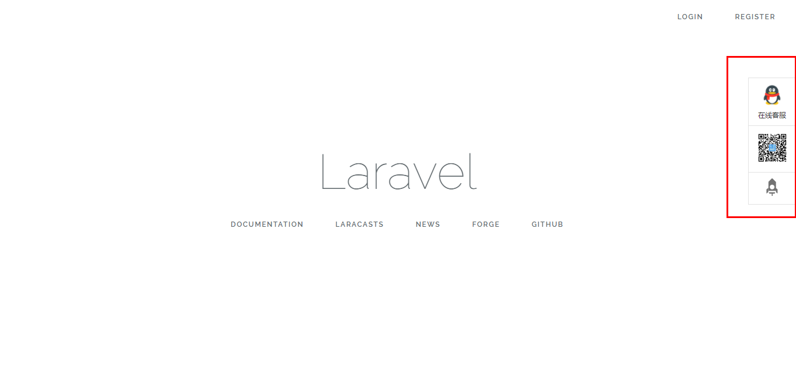

Laravel5-Online-Kefu
---------

Laravel5-Online-Kefu 是一个快速生成右侧悬浮客服代码的组件，支持 Laravel5 项目。


## 更新记录

* 2017-10-12 `Release v1.0.1` 修改客服配置文件，调整左侧浮窗未知。
* 2017-10-11 `Release v1.0.0` 完成初始化功能，可以正常使用。

## 安装流程

1、安装的两种方式

① 直接编辑配置文件

将以下内容增加到 composer.json：

```json
require: {
    "chenhua/laravel5-online-kefu": "~1.0"
}
```

然后运行 `composer update`。

② 执行命令安装

运行命令：

```bash
composer require chenhua/laravel5-online-kefu
```

2、完成上面的操作后，修改 `config/app.php` 中 `providers` 数组

```php
Chenhua\OnlineKefu\OnlineKefuServiceProvider::class,
```

3、执行 `artisan` 命令，生成 `config/kefu.php` 配置文件

```bash
php artisan vendor:publish --tag=kefu
```

4、`config/kefu.php` 修改配置项

```bash

```

## 使用

### 常规使用

在视图文件中引入对应的样式组件，如 `layouts/app.blade.php` 中加入（以下任选一种样式）

```html
@include('kefu::default')
```

```html
@include('kefu::simple')
```

### 可能需要修改

如果项目中已引入过jquery，`resources\views\vendor\kefu\default.blade.php` 或者 `resources\views\vendor\kefu\default.blade.php`
中，可以去掉以下代码：

```html
<script src="https://cdn.bootcss.com/jquery/1.12.4/jquery.min.js"></script>
```

### 效果展示

default样式：


simple样式：



## License
除 “版权所有（C）阿里云计算有限公司” 的代码文件外，遵循 [MIT license](http://opensource.org/licenses/MIT) 开源。


